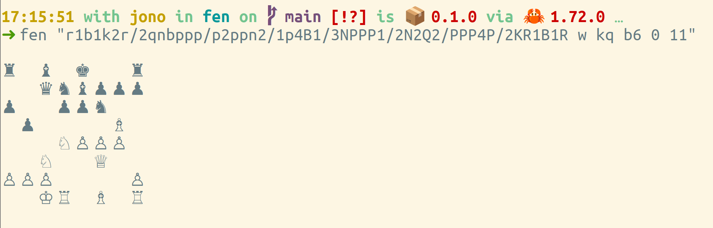
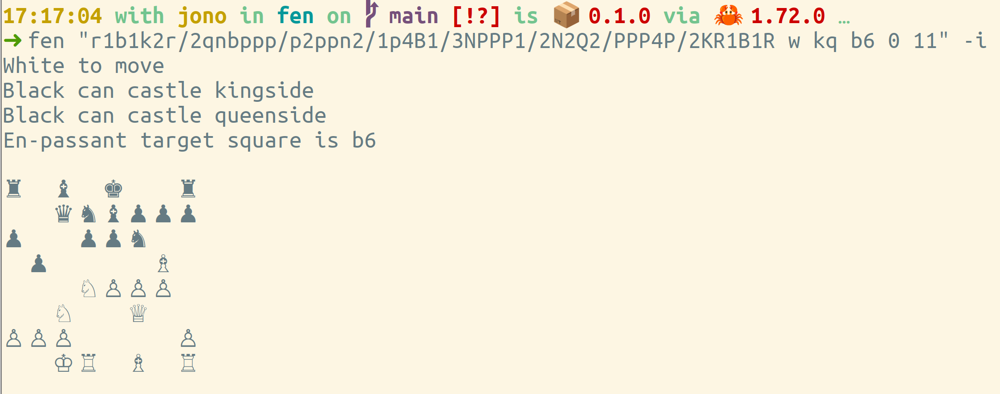
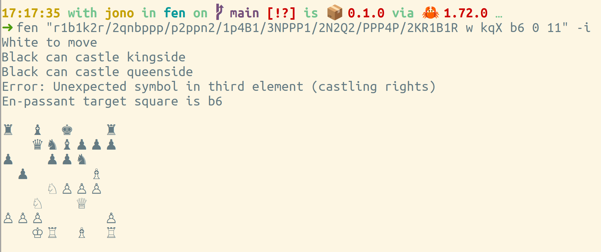
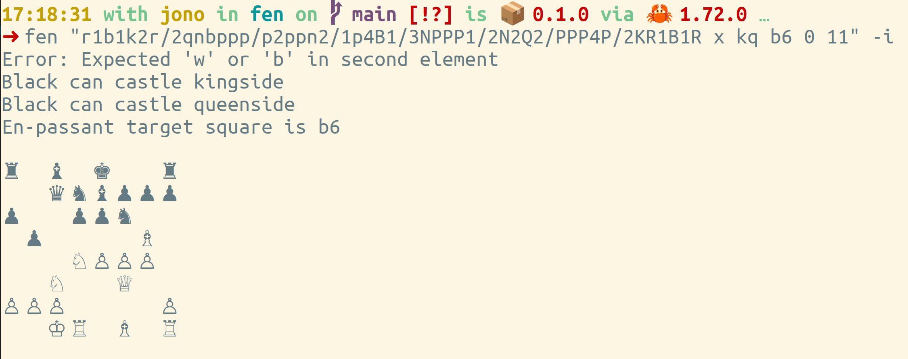
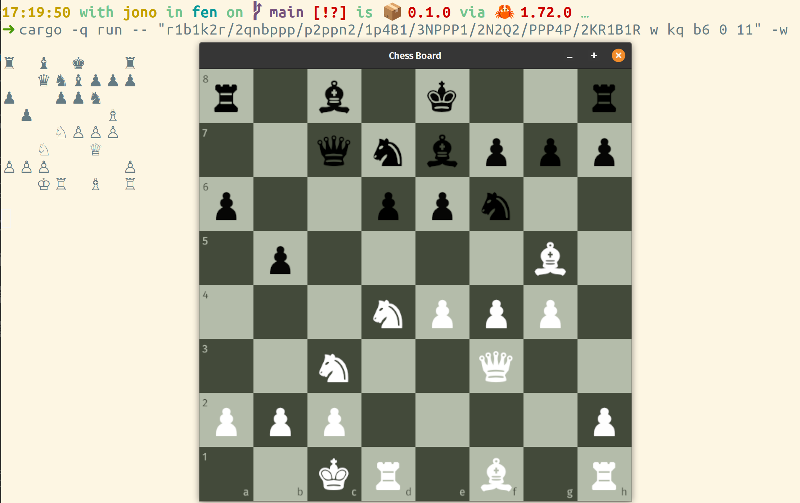

# fen

Parse a Forsyth–Edwards Notation (FEN) string

Validates most of the components and produces either
a terminal or graphical representation of the board

## Examples

Parse and validate a FEN string, producing a terminal representation of the board

```
cargo -q run -- "r1b1k2r/2qnbppp/p2ppn2/1p4B1/3NPPP1/2N2Q2/PPP4P/2KR1B1R w kq b6 0 11"
```


Add information regarding whose turn it is, castling, en-passant

```
cargo -q run -- "r1b1k2r/2qnbppp/p2ppn2/1p4B1/3NPPP1/2N2Q2/PPP4P/2KR1B1R w kq b6 0 11" -i
```




Validation should catch errors such as incorrect castling rights

```
cargo -q run -- "r1b1k2r/2qnbppp/p2ppn2/1p4B1/3NPPP1/2N2Q2/PPP4P/2KR1B1R w kqX b6 0 11" -i
```



and incorrect turn notation

```
cargo -q run -- "r1b1k2r/2qnbppp/p2ppn2/1p4B1/3NPPP1/2N2Q2/PPP4P/2KR1B1R x kq b6 0 11" -i
```



In addition to the terminal view, a graphical window view can be created using the `-w` flag

```
cargo -q run -- "r1b1k2r/2qnbppp/p2ppn2/1p4B1/3NPPP1/2N2Q2/PPP4P/2KR1B1R w kq b6 0 11" -i -w
```



## Known Issues

- Because of the way that `piston` loads the font as a `GlyphCache` referring to a font file, 
this crate can only be run from within the top-level `fen/` directory (as `assets/` is relative). 
A workaround for this, to enable site-wide installation, would be most welcome.

- This does not detect _illegal_ positions, it merely parses the FEN as given.